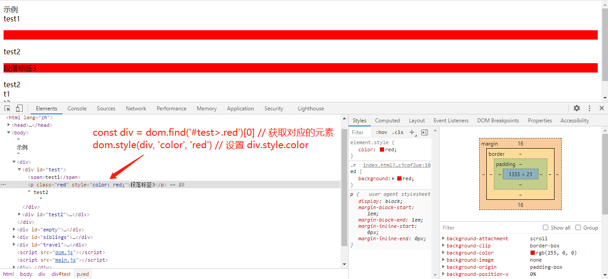
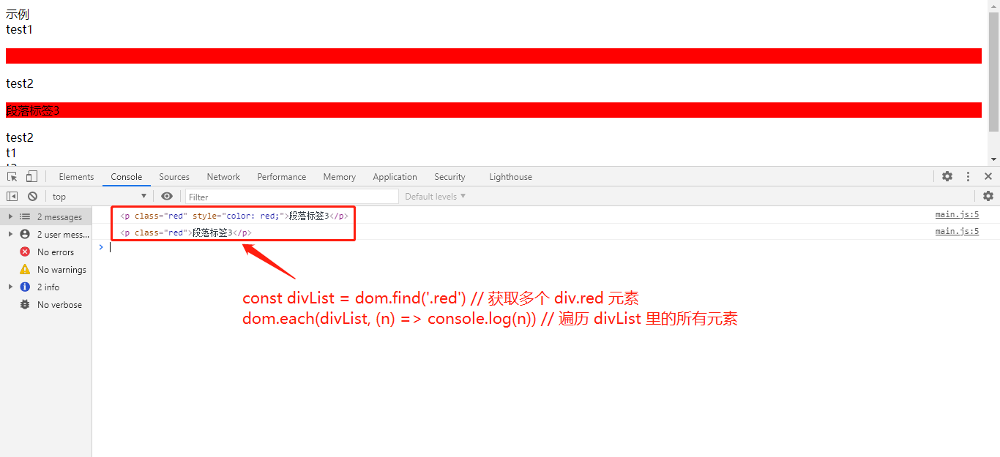

const div = dom.find('#test>.red')[0] // 获取对应的元素
dom.style(div, 'color', 'red') // 设置 div.style.color

const divList = dom.find('.red') // 获取多个 div.red 元素
dom.each(divList, (n) => console.log(n)) // 遍历 divList 里的所有元素
